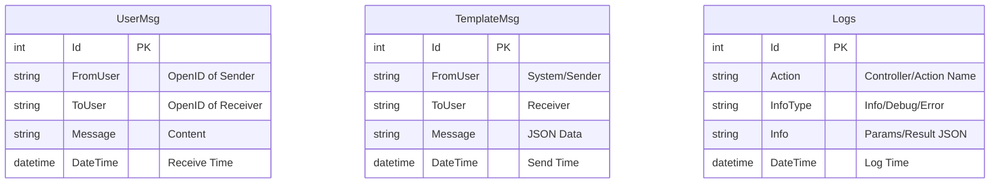

# Project Design: DQSM WeChat Interaction System

## 1. System Architecture
The system follows a clean MVC architecture with strict separation of concerns, powered by .NET 8.

```mermaid
graph TD
    User((User/WeChat)) -->|HTTP Request| WebLayer[Web Layer (MVC)]
    
    subgraph "Web Layer"
        Filter[Global Audit Filter (AOP)]
        Controller[WeChat Controller]
        UI[Razor Views (Dashboard)]
    end
    
    subgraph "Service Layer"
        LogSvc[Static Log Service]
        WeChatSvc[WeChat Service]
    end
    
    subgraph "Data Layer"
        EF[EF Core DbContext]
        Repo[Repositories]
    end
    
    subgraph "Database"
        MySQL[(MySQL 8.0)]
    end

    WebLayer --> Filter
    Filter --> LogSvc
    Controller --> WeChatSvc
    WeChatSvc --> EF
    LogSvc --> EF
    EF --> MySQL
```

## 2. ER Diagram (Entity Relationship)



## 3. UI/UX Specifications
- **Framework**: Bootstrap 5 (integrated with Layout).
- **Theme**: Light/Clean.
    - Primary Color: `#0d6efd` (Blue).
    - Background: `#f8f9fa` (Light Gray).
    - Card Style: White background, `border-radius: 8px`, `box-shadow: 0 2px 4px rgba(0,0,0,0.05)`.
- **Interactions**:
    - Global Layout with Navigation.
    - Toast notifications for operations.
    - Responsive tables for log viewing.

## 4. Key Interfaces (API)
| Controller | Method | Route | Description |
|------------|--------|-------|-------------|
| WeChat | Receive (GET) | /WeChat/Receive | Verify WeChat Server config |
| WeChat | Receive (POST) | /WeChat/Receive | Handle incoming messages |
| WeChat | SendTemplate (POST) | /WeChat/SendTemplate | Send template message |
| Logs | Index (GET) | /Logs/Index | View system logs |
